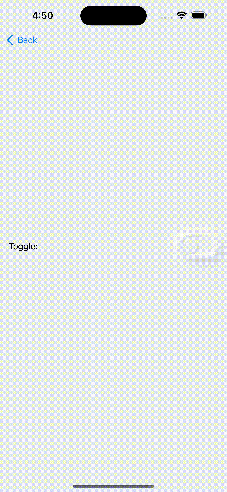

# SSNeumorphicView

SSNeumorphicView is a sophisticated and flexible library for iOS that seamlessly integrates the trendy Neumorphic design style into your app’s user interface. Neumorphism, known for its soft, subtle shadowing combined with depth and texture, creates an elegant, soft-embossed effect that makes your UI components look tactile and engaging. 🌟✨

SSNeumorphicView simplifies the process of incorporating Neumorphic elements into your app, providing both UIKit and SwiftUI compatibility. With extensive customization options for shadow colors, depths, and styles, you can craft a modern and visually appealing user experience effortlessly. 🎨🖌️💡 Plus, it's backward compatible with iOS 13, ensuring broad support across various devices. 📱🔄

[![Swift Version][swift-image]][swift-url]
[![License][license-image]][license-url]
[![SwiftPM Compatible][spm-image]][spm-url]
[](https://cocoapods.org/pods/SSNeumorphicView)
[![Platform][platform-image]][platform-url]
[![PRs Welcome][PR-image]][PR-url]


# Features! :sparkles:
- 🎨 Seamless Neumorphic Integration: Easily apply Neumorphic designs to views, buttons, text fields, and toggle views with just a few lines of code.
- 🌗 Dynamic Adaptation for Light and Dark Modes: Automatically adapts to both light and dark modes, ensuring your app looks great regardless of the user’s device settings.
- 🖌️ Customizable Shadows: Support for both inner and outer shadows, allowing you to create depth and emboss effects that suit your design needs.
- 🧩 Compatibility with UIKit and SwiftUI: Leverage the power of Neumorphic design across both UIKit and SwiftUI, providing flexibility in how you build your iOS app.
- 🛠️ Easy Customization: Customize shadow colors, depths, corner radius, and more to match your app’s design language.
- 🧱 Out-of-the-Box Components: Prebuilt Neumorphic components such as buttons and toggle views, with customizable styles like NMButtonStyle and NMToggleStyle, allowing you to further tailor their appearance and behavior.
- ⚡ Efficient Performance: Built with performance in mind, SSNeumorphicView ensures smooth animations and transitions, even on devices with lower processing power.
- 📚 Detailed Documentation and Examples: Comprehensive guides and examples to help you get started quickly and efficiently.
- 🔄 Responsive Design: Ensures your Neumorphic elements look great on various screen sizes and orientations.

# Example :iphone:

To run the example project, clone the repo, and run `pod install` from the Example directory first.

# Requirements :clipboard:
- iOS 13.0+
- Xcode 11+

# Installation :package:
 **CocoaPods**
 
 [CocoaPods][CocoaPods.org] is a dependency manager for Cocoa projects. You can install it with the following command:

```bash
$ gem install cocoapods
```

Navigate to project root folder to integrate pod.

```bash
$ pod init
```

It will generate `Podfile` for your project. To integrate SSNeumorphicView into your project specify it in your `Podfile`:

```ruby
platform :ios, '13.0'
use_frameworks!

target '<Your Target Name>' do
    pod 'SSNeumorphicView'
end
```

Then, run the following command:

```bash
$ pod install
```

It will generate `<Project>.xcworkspace` file. From now on you should open the project using this file.

**Swift Package Manager**
 
You can install `SSNeumorphicView` using [Swift Package Manager] by:

1. Go to `Xcode` -> `File` -> `Add Package Dependencies...`
2. Add package URL [https://cocoapods.org/pods/SSNeumorphicView][SSNeumorphicView]

```swift
dependencies: [
    .package(url: "https://github.com/SimformSolutionsPvtLtd/SSNeumorphicKit.git", from: "0.1.2")
]
```

**Manually**

- Add SSNeumorphicView folder from /Sources folder to your project.

# Usage example :bulb:

## How to use with UIKit and Storyboard: :framed_picture:

### In the storyboard add a UIView and change its class to SSNeumorphicView

   
 
### NOTE:
- For **UIButton** add **SSNeumorphicButton** as its class.
- For **UITextField** add **SSBaseTextField** as its class.

### Import Neumorphic package to your view.
        
    import SSNeumorphicView

### Create NeumorphicView with the outer shadow.

| <center> Light Mode </center> | <center> Dark Mode </center> |
|----------|----------|
|  |  |


    @IBOutlet weak var viewNeumorphic: SSNeumorphicView! {
        didSet {
            viewNeumorphic.viewDepthType = .outerShadow
        }
    }
        
### Create neumorphic text field with the Inner shadow.

| <center> Light Mode </center> | <center> Dark Mode </center> |
|----------|----------|
|  |  |

 
    @IBOutlet weak var txtSSNeumorphic: SSBaseTextField! {
        didSet {
            txtSSNeumorphic.txtDepthType = .innerShadow
        }
    }

### Create neumorphic button with the Outer shadow.

| <center> Light Mode </center> | <center> Dark Mode </center> |
|----------|----------|
|  |  |

 
    @IBOutlet weak var btnNeumorphic: SSNeumorphicButton! {
        didSet {
            btnNeumorphic.btnDepthType = .outerShadow
        }
    }
    
### Create neumorphic rounded button with the inner shadow.

| <center> Light Mode </center> | <center> Dark Mode </center> |
|----------|----------|
|  |  |


    @IBOutlet weak var btnRoundedNeumorphic: SSNeumorphicButton! {
        didSet {
            btnRoundedNeumorphic.btnDepthType = .innerShadow
            btnRoundedNeumorphic.layer.masksToBounds = true
            btnRoundedNeumorphic.btnNeumorphicCornerRadius =  btnRoundedNeumorphic.frame.width/2
        }
    }
    
### How to Use with SwiftUI: :jigsaw:
### Import Neumorphic package to your view.
        
    import SSNeumorphicView

### **Create Neumorphic Shape with [Inner shadow modifier](Sources/SSNeumorphicView/Classes/SwiftUI/Modifiers/InnerShadowModifier.swift)**.
| <center> Light Mode</center> | <center> Dark Mode </center> |
|----------|----------|
|  |    | 

```
var body: some View {
        
    ZStack {
            
        // Apply main background color
        mainColor   
            
        VStack {
            RoundedRectangle(cornerRadius: 25)

                // Fill the shape with samecolor as background
                .fill(mainColor)    
                .frame(width: 150, height: 150)

                 // Apply inner shadow modifier
                .innerShadow(RoundedRectangle(cornerRadius: 25),   
                                darkShadow: darkShadow, // Pass dark shadow color for the innerShadow
                                lightShadow: lightShadow)   // Pass light shadow color for the outerShadow
        }
    }
    .edgesIgnoringSafeArea(.all)
}
```

### **Create Neumorphic Shape with [Outer shadow modifier](Sources/SSNeumorphicView/Classes/SwiftUI/Modifiers/OuterShadowModifier.swift)**.
| <center> Light Mode</center> | <center> Dark Mode </center> |
|----------|----------|
|  |    | 

```
var body: some View {
        
        ZStack {
            
            // Apply main background color
            mainColor
            
            VStack {
                RoundedRectangle(cornerRadius: 25)
                
                    // Fill the shape with same color as background
                    .fill(mainColor)
                    .frame(width: 150, height: 150)
                
                    // Apply the outer shadow modifier and pass the dark and light shadow colors
                    .outerShadow(darkShadow: darkShadow, lightShadow: lightShadow)
            }
        }
        .edgesIgnoringSafeArea(.all)
    }
```

### **Create Neumorphic Button Using [NMButtonStyle](Sources/SSNeumorphicView/Classes/SwiftUI/Styles/NMButtonStyle.swift)**.
| <center> Light Mode</center> | <center> Dark Mode </center> |
|----------|----------|
|  |    | 

```
var body: some View {
        
        ZStack {
            
            // Apply main background color
            mainColor
            
            VStack {
                Button(action: {
                    print("Button tapped")
                }) {
                    Text("Tap me!")
                }
                
                // Use Custom NMButtonStyle to make the button Neumorphic.
                .buttonStyle(NMButtonStyle(shape: RoundedRectangle(cornerRadius: 20),
                                           primaryColor: mainColor,
                                           lightColor: lightShadow,
                                           darkColor: darkShadow))
            }
        }
        .edgesIgnoringSafeArea(.all)
    }
```
**NOTE:** To fully customize the NMButtonStyle checkout [NMButtonStyleGuide.md](Docs/NMButtonStyleGuide.md).

### **Create Neumorphic Image Button using [NMButtonStyle](Sources/SSNeumorphicView/Classes/SwiftUI/Styles/NMButtonStyle.swift)**.
| <center> Light Mode</center> | <center> Dark Mode </center> |
|----------|----------|
|  |    | 

```
var body: some View {
        
        ZStack {
            
            // Apply main background color
            mainColor
            
            VStack {
                Button(action: {
                    print("Button tapped")
                }) {
                    Image(systemName: "heart.fill")
                        .font(.title)
                }

                // Use Custom NMButtonStyle to make the button Neumorphic.
                .buttonStyle(NMButtonStyle(shape: Circle(),
                                           primaryColor: mainColor,
                                           lightColor: lightShadow,
                                           darkColor: darkShadow))
            }
        }
        .edgesIgnoringSafeArea(.all)
    }
```
**NOTE:** You can also create your own custom style with combination of outer and inner shadow modifiers.

### **Create Neumorphic Text Field with [Inner Shadow Modifier](Sources/SSNeumorphicView/Classes/SwiftUI/Modifiers/InnerShadowModifier.swift)**.
| <center> Light Mode</center> | <center> Dark Mode </center> |
|----------|----------|
|  |    | 

```
var body: some View {
        
        ZStack {
            
            // Apply main background color
            mainColor
            
            VStack {
                TextField("Enter text", text: $text)
                    .padding()
                
                    // Apply the Shadow shape as background of text field.
                    .background(RoundedRectangle(cornerRadius: 30)
                        .fill(mainColor)
                        .innerShadow(RoundedRectangle(cornerRadius: 30),
                                     darkShadow: darkShadow,
                                     lightShadow: lightShadow), alignment: .center)
                    .padding()
            }
        }
        .edgesIgnoringSafeArea(.all)
    }
```

### **Create Neumorphic Text Field with [Outer shadow modifier](Sources/SSNeumorphicView/Classes/SwiftUI/Modifiers/OuterShadowModifier.swift)**.
| <center> Light Mode</center> | <center> Dark Mode </center> |
|----------|----------|
|  |    | 

```
var body: some View {
        
        ZStack {
            
            // Apply main background color
            mainColor
            
            VStack {
                TextField("Enter text", text: $text)
                    .padding()
                
                    // Apply the Shadow shape as background of text field.
                    .background(RoundedRectangle(cornerRadius: 30)
                        .fill(mainColor)
                        .outerShadow(darkShadow: darkShadow,
                                     lightShadow: lightShadow), alignment: .center)
                    .padding()
            }
        }
        .edgesIgnoringSafeArea(.all)
    }
```

### **Create Neumorphic Toggle using [NMToggleStyle](Sources/SSNeumorphicView/Classes/SwiftUI/Styles/NMToggleStyle.swift)**.


```
var body: some View {
        
        ZStack {
            
            // Apply main background color
            mainColor
            
            VStack {
                Toggle("Toggle: ", isOn: $isOn)
                    .toggleStyle(
                        NMToggleStyle(
                            tintColor: .green,
                            offTintColor: mainColor,
                            offDarkShadow: darkShadow,
                            offLightShadow: lightShadow,
                            hideLabel: false
                        )
                    )
                    .padding()
            }
        }
        .edgesIgnoringSafeArea(.all)
    }
```
**NOTE:** To fully customize the NMToggleStyle checkout [NMToggleStyleGuide.md](Docs/NMToggleStyleGuide.md).

## 🤝 How to Contribute

Whether you're helping us fix bugs, improve the docs, or a feature request, we'd love to have you! :muscle:

Check out our [**Contributing Guide**](CONTRIBUTING.md) for ideas on contributing.

## Bugs and Feedback :beetle:

For bugs, feature requests, and discussion use [GitHub Issues].

## Find this samples useful? :heart:

Support it by joining [stargazers] :star: for this repository.

## Check out our other Libraries

<h4><a href="https://github.com/SimformSolutionsPvtLtd/Awesome-Mobile-Libraries"><u>🗂 Simform Solutions Libraries→</u></a></h4>

## License :scroll:

SSNeumorphicView is available under the MIT license. See the [LICENSE](./LICENSE) file for more info.


[swift-image]:https://img.shields.io/badge/swift-5.0-orange.svg
[swift-url]: https://swift.org/
[license-image]: https://img.shields.io/badge/License-MIT-blue.svg
[license-url]: LICENSE
[travis-image]: https://img.shields.io/travis/dbader/node-datadog-metrics/master.svg?style=flat-square
[travis-url]: https://travis-ci.org/dbader/node-datadog-metrics
[carthage-image]:https://img.shields.io/badge/Carthage-compatible-4BC51D.svg?style=flat
[carthage-url]: https://github.com/Carthage/Carthage
[spm-image]:https://img.shields.io/badge/SwiftPM-compatible-brightgreen.svg
[spm-url]: https://swift.org/package-manager
[platform-image]:https://img.shields.io/cocoapods/p/LFAlertController.svg?style=flat
[platform-url]:http://cocoapods.org/pods/LFAlertController
[cocoa-image]:https://img.shields.io/cocoapods/v/EZSwiftExtensions.svg
[cocoa-url]:https://img.shields.io/cocoapods/v/LFAlertController.svg
[PR-image]:https://img.shields.io/badge/PRs-welcome-brightgreen.svg?style=flat-square
[PR-url]:http://makeapullrequest.com
[Swift Package Manager]:https://www.swift.org/package-manager
[Github Issues]:https://github.com/SimformSolutionsPvtLtd/SSNeumorphicKit/issues
[CocoaPods]:https://cocoapods.org/pods/SSNeumorphicView
[CocoaPods.org]:https://cocoapods.org/
[stargazers]:https://github.com/SimformSolutionsPvtLtd/SSNeumorphicKit/stargazers
[Documentation]:https://swiftpackageindex.com/SimformSolutionsPvtLtd/SSNeumorphicView
[SSNeumorphicView]:https://github.com/SimformSolutionsPvtLtd/SSNeumorphicKit